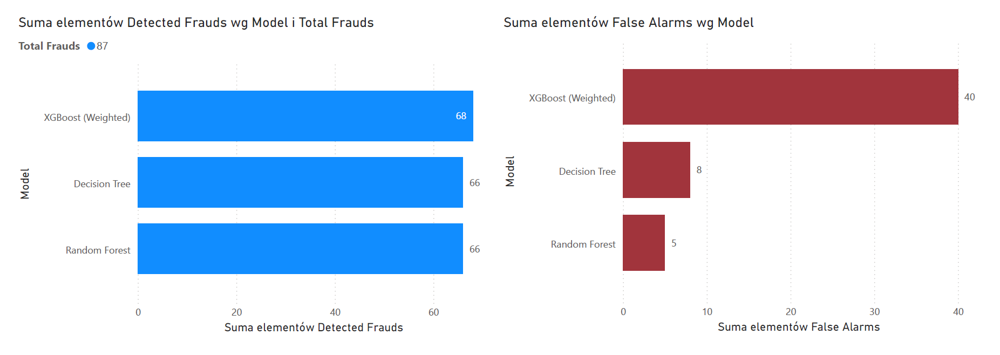

# Credit Card Fraud Detection: Comparative Analysis

## 📌 Project Overview
The objective of this project is to identify fraudulent credit card transactions. Due to the extreme class imbalance (only 492 frauds out of 284,807 transactions), I implemented and compared three different Machine Learning architectures to find the optimal balance between fraud detection (Recall) and operational costs (False Alarms).

## 🛠️ Tech Stack
* **Language:** Python (Pandas, Scikit-learn, XGBoost)
* **Visualizations:** Power BI Desktop
* **Algorithms:** Decision Tree, Random Forest, Weighted XGBoost

## 📊 Model Performance Comparison
I evaluated the models using **Mean Absolute Error (MAE)** and a **Confusion Matrix** to track how many frauds were caught versus how many legal transactions were incorrectly flagged.

| Model | MAE | Detected Frauds (Recall) | False Alarms | Status |
| :--- | :--- | :--- | :--- | :--- |
| **Decision Tree** | 0.000632 | 66 / 87 | 8 | Baseline |
| **Random Forest** | 0.000850 | 66 / 87 | **5** | **Most Stable** |
| **XGBoost (Weighted)**| 0.021853 | **68 / 87** | 40 | **Highest Recall** |

## 📈 Business Insights (Power BI Dashboard)
Below is a visual representation of the trade-off between sensitivity and precision. 

### Key Conclusions:
* **Handling Imbalance:** By applying `scale_pos_weight=580` in XGBoost, I successfully prioritized the minority class, increasing fraud detection from 66 to 68 cases.
* **The Trade-off:** * **Random Forest** is the best choice if the goal is to minimize customer friction (only 5 false alarms).
    * **XGBoost** is superior if the bank's priority is maximum security, accepting a higher manual verification rate (40 false alarms) to catch more fraudsters.
* **Data Science Approach:** This project demonstrates that a "perfect" model depends on business goals—balancing the cost of fraud against the cost of false positives.

## 🚀 How to Run
1. Clone the repository.
2. Download `creditcard.csv` from Kaggle and place it in the root folder.
3. Install dependencies: `pip install pandas scikit-learn xgboost`
4. Run the comparison script: `python fraud_detection_comparison.py`
